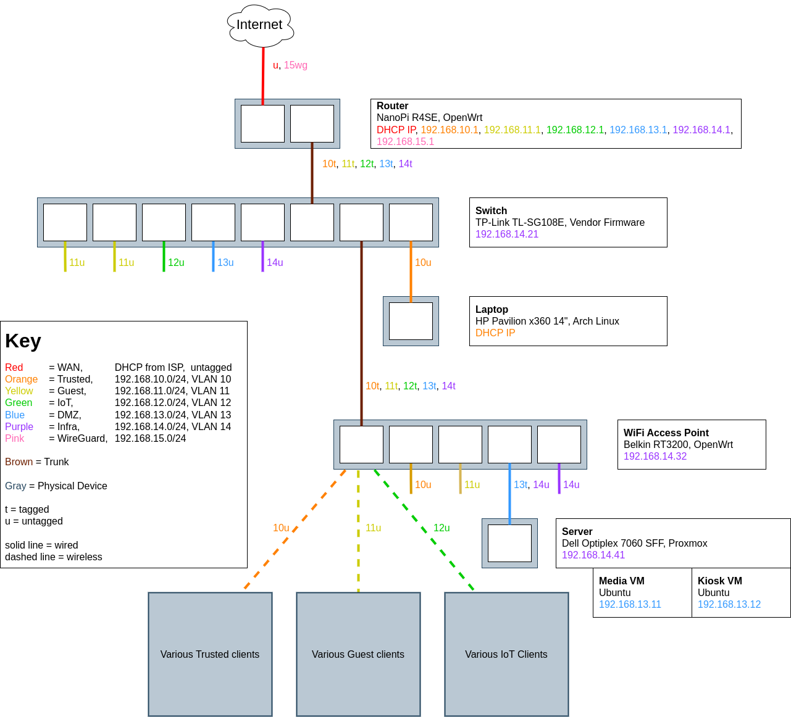

# network-config
Configuration files for the equipment which runs my home network

## Diagrams

### Network Layout

### Subnet Features

| Subnet    | VLAN ID       | DHCP  | DNS   | WIFI  | INPUT | OUTPUT    | FORWARD   |
| --------- | ------------- | ----- | ----- | ----- | ----- | --------- | --------- |
| WAN       | (untagged)    | ❌    | ❌    | ❌    | ❌    | ✅        | ❌        |
| Trusted   | 10            | ✅    | ✅    | ✅    | ✅    | ✅        | ❌        |
| Guest     | 11            | ✅    | ✅    | ✅    | ❌    | ✅        | ❌        |
| IoT       | 12            | ✅    | ❌    | ✅    | ❌    | ✅        | ❌        |
| DMZ       | 13            | ✅    | ✅    | ❌    | ❌    | ✅        | ❌        |
| Infra     | 14            | ❌    | ❌    | ❌    | ❌    | ✅        | ❌        |
| Wireguard | (n/a)         | (n/a) | ✅    | ❌    | ✅    | ✅        | ❌        |

### Subnet Forwarding

(from row to column)

| Subnet    | WAN   | Trusted   | Guest | IoT   | DMZ   | Infra | Wireguard |
| --------- | ----- | --------- | ----- | ----- | ----- | ----- | --------- |
| WAN       | ✅    | ❌        | ❌    | ❌    | ❌    | ❌    | ❌        |
| Trusted   | ✅    | ✅        | ✅    | ✅    | ✅    | ✅    | ✅        |
| Guest     | ✅    | ❌        | ✅    | ❌    | ❌    | ❌    | ❌        |
| IoT       | ❌    | ❌        | ❌    | ✅    | ❌    | ❌    | ❌        |
| DMZ       | ✅    | ❌        | ❌    | ❌    | ✅    | ❌    | ❌        |
| Infra     | ❌    | ❌        | ❌    | ❌    | ❌    | ✅    | ❌        |
| Wireguard | ❌    | ✅        | ✅    | ✅    | ✅    | ✅    | ✅        |

